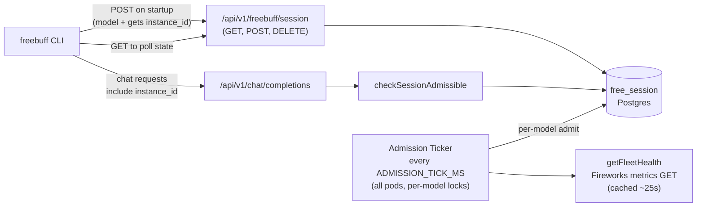
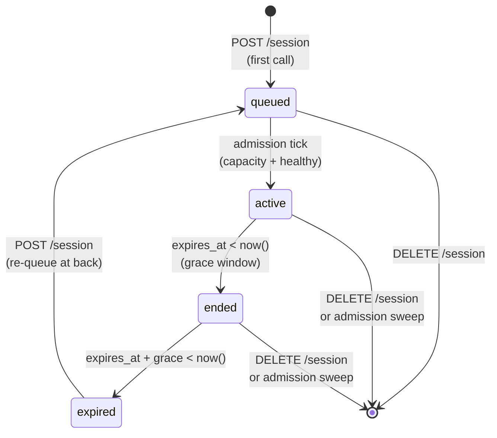

# Freebuff Waiting Room

## Overview

The waiting room is the admission control layer for **free-mode** requests against the freebuff Fireworks deployments. It has three jobs:

1. **Drip-admit users per model** — each selectable freebuff model has its own FIFO queue. Admission runs one tick (default `ADMISSION_TICK_MS`, 15s) that tries to admit one user per model, so heavier models can sit cold without starving lighter ones.
2. **Gate on per-deployment health and hours** — a single fleet probe per tick (`getFleetHealth` in `web/src/server/free-session/fireworks-health.ts`) hits the Fireworks metrics endpoint and classifies each dedicated deployment as `healthy | degraded | unhealthy`. Only models whose deployment is `healthy` and currently available admit that tick; models without a dedicated deployment are treated as serverless and always available.
3. **One instance per account** — prevent a single user from running N concurrent freebuff CLIs to get N× throughput.

Users who cannot be admitted immediately are placed in the queue for their chosen model and given an estimated wait time. Admitted users get a fixed-length session (default 1h) bound to the model they were admitted on; chat completions use that model for the life of the session.

The entire system is gated by the env flag `FREEBUFF_WAITING_ROOM_ENABLED`. When `false`, the gate is a no-op and the admission ticker does not start; free-mode traffic flows through unchanged.

## Kill Switch

```bash
# Disable entirely (both the gate on chat/completions and the admission loop)
FREEBUFF_WAITING_ROOM_ENABLED=false

# Other knob (only read when enabled)
FREEBUFF_SESSION_LENGTH_MS=3600000         # 1 hour
```

Flipping the flag is safe at runtime: existing rows stay in the DB and will be admitted / expired correctly whenever the flag is flipped back on.

## Architecture



### Components

- **`free_session` table** (Postgres) — single source of truth for queue + active-session state. One row per user (PK on `user_id`), with a `model` column recording which queue the row belongs to.
- **Model registry** (`common/src/constants/freebuff-models.ts`) — `FREEBUFF_MODELS` is the authoritative list of selectable models. Adding a new freebuff model means adding an entry here; the admission ticker iterates this list every tick.
- **Public API** (`web/src/server/free-session/public-api.ts`) — `requestSession`, `getSessionState`, `endUserSession`, `checkSessionAdmissible`. Pure business logic; DI-friendly. `requestSession` accepts the user's chosen `model` and can return `model_locked` when a session is already active on a different model.
- **Store** (`web/src/server/free-session/store.ts`) — all DB ops. Transaction boundaries and per-model advisory locks live here.
- **Fleet health probe** (`web/src/server/free-session/fireworks-health.ts`) — `getFleetHealth()` does a single HTTP GET against the Fireworks metrics endpoint and returns a `Record<modelId, 'healthy' | 'degraded' | 'unhealthy'>`. Cached ~25s (under the Fireworks 30s exporter cadence and 6 req/min rate limit). Models without a dedicated deployment in `FIREWORKS_DEPLOYMENT_MAP` (e.g. serverless) are absent from the map and treated as `healthy` at call sites.
- **Admission ticker** (`web/src/server/free-session/admission.ts`) — self-scheduling timer that runs every `ADMISSION_TICK_MS`. Each tick sweeps expired rows once, resolves fleet health once, then admits one queued user per model in parallel (each guarded by a model-keyed advisory lock).
- **HTTP routes** (`web/src/app/api/v1/freebuff/session/`) — thin wrappers that resolve the API key → `userId` and delegate to the public API.
- **Chat-completions gate** (`web/src/app/api/v1/chat/completions/_post.ts`) — for free-mode requests, calls `checkSessionAdmissible(userId, claimedInstanceId)` after the rate-limit check and rejects non-admissible requests with a structured error. The admitted session's `model` is what gets sent to the upstream.

## Database Schema

```sql
CREATE TYPE free_session_status AS ENUM ('queued', 'active');

CREATE TABLE free_session (
  user_id             text PRIMARY KEY REFERENCES "user"(id) ON DELETE CASCADE,
  status              free_session_status NOT NULL,
  active_instance_id  text NOT NULL,
  model               text NOT NULL,
  country_code        text,
  cf_country          text,
  geoip_country       text,
  country_block_reason text,
  ip_privacy_signals  text[],
  client_ip_hash      text,
  country_checked_at  timestamptz,
  queued_at           timestamptz NOT NULL DEFAULT now(),
  admitted_at         timestamptz,
  expires_at          timestamptz,
  created_at          timestamptz NOT NULL DEFAULT now(),
  updated_at          timestamptz NOT NULL DEFAULT now()
);

-- Per-model dequeue: WHERE status='queued' AND model=$1 ORDER BY queued_at
CREATE INDEX idx_free_session_queue  ON free_session (status, model, queued_at);
CREATE INDEX idx_free_session_expiry ON free_session (expires_at);
```

Migrations: `packages/internal/src/db/migrations/0043_vengeful_boomer.sql` (initial table) and `0044_violet_stingray.sql` (added the `model` column and rebuilt the queue index).

**Design notes**

- **PK on `user_id`** is the structural enforcement of "one session per account". No app-logic race can produce two rows for one user.
- **`active_instance_id`** rotates on every `POST /session` call. This is how we enforce one-CLI-at-a-time (see [Single-instance enforcement](#single-instance-enforcement)).
- **`model` column.** Populated by the POST handler; determines which queue the row belongs to while queued and is fixed for the life of an active session. Switching models while an active session is live is rejected (`model_locked`, 409).
- **Country/privacy columns.** Populated from the POST `/session` country gate so active-session audits can see the resolved country, Cloudflare country header, GeoIP fallback country, IPinfo privacy signals, and a keyed hash of the client IP. Raw IPs are not stored.
- **All timestamps server-supplied.** The client never sends `queued_at`, `admitted_at`, or `expires_at` — they are either `DEFAULT now()` or computed server-side during admission.
- **FK CASCADE on user delete** keeps the table clean without a background job.

## State Machine



Neither `ended` nor `expired` is a stored status — they are derived from `expires_at` versus `now()` and the grace window:

- `expires_at > now()` → `active` (gate: `ok: 'active'`; wire: `active`)
- `expires_at <= now() < expires_at + grace` → `ended` on the wire (gate still admits with `ok: 'draining'`; client must stop accepting new prompts but can let an in-flight agent finish)
- `expires_at + grace <= now()` → `expired` (gate: `session_expired`; wire: `none` after sweep); swept by the admission ticker

## Single-instance Enforcement

The challenge: a user running two CLIs on the same account should not get 2× throughput.

The PK on `user_id` gives us one session row per user, but both CLIs could share that row and double up their request rate (bounded only by the per-user rate limiter, which isn't ideal).

The solution: `active_instance_id`.

1. On startup, the CLI calls `POST /api/v1/freebuff/session`. The server generates a fresh UUID (`active_instance_id`), stores it, and returns it.
2. Every subsequent chat request includes that id in `codebuff_metadata.freebuff_instance_id`.
3. `checkSessionAdmissible` rejects the request with `session_superseded` (HTTP 409) if the claimed id doesn't match the stored one.
4. When the user starts a second CLI, it calls `POST /session`, which rotates `active_instance_id`. The first CLI's subsequent request hits 409, so only the latest CLI can actually make chat requests.

The rotation is important: it happens even if the caller is already in the `active` state, so a second CLI always wins. Any other design (first-wins, take-over-requires-force-flag) would allow the attacker to keep the old CLI alive forever.

### What this does NOT prevent

- A single user manually syncing `instance_id` between two CLIs (e.g. editing a config file). This is possible but requires them to re-sync after every startup call, so it's high-friction. We accept this.
- A user creating multiple accounts. That is covered by other gates (MIN_ACCOUNT_AGE_FOR_PAID_MS, geo check) and the overall drip-admission rate.

## Admission Loop

All pods start a ticker on boot. Coordination is by **per-model** Postgres advisory locks: the lock id is `FREEBUFF_ADMISSION_LOCK_ID + hashStringToInt32(model)`, so different models can admit concurrently across pods while a single model is still serialized. Each per-model attempt takes the lock inside a transaction via `pg_try_advisory_xact_lock`; if the lock is held by another pod, that model is a no-op on this pod for this tick. The lock is released automatically when the transaction commits.

Each tick does (in order):

1. **Sweep expired.** `DELETE FROM free_session WHERE status='active' AND expires_at < now() - grace`. Runs once per tick regardless of upstream health so zombie sessions are cleaned up even during an outage.
2. **Fleet health probe.** `getFleetHealth()` returns a `Record<modelId, 'healthy' | 'degraded' | 'unhealthy'>`. One HTTP call per tick (cached ~25s across pods) covers every model. Deployment absent from the fleet map (serverless) defaults to `healthy` at the call site.
3. **Admit per model, in parallel.** For each model in `FREEBUFF_MODELS`, call `admitFromQueue({ model, health, sessionLengthMs, now })`:
   - If `health !== 'healthy'`, returns `{ admitted: [], skipped: health }` without touching Postgres — the model's queue pauses and grows until recovery.
   - Otherwise opens a transaction, takes the per-model advisory lock, and `SELECT ... WHERE status='queued' AND model=$1 ORDER BY queued_at, user_id LIMIT 1 FOR UPDATE SKIP LOCKED` → `UPDATE` the row to `status='active'` with `admitted_at=now()`, `expires_at=now()+sessionLength`. One admit per model per tick keeps Fireworks from a thundering herd of newly-admitted CLIs.

The final tick result carries a `queueDepthByModel` map and a single `skipped` reason (the first non-null skip across models) for observability.

### Tunables

| Constant                     | Location                                  | Default                                                             | Purpose                                                                                                                                                                     |
| ---------------------------- | ----------------------------------------- | ------------------------------------------------------------------- | --------------------------------------------------------------------------------------------------------------------------------------------------------------------------- |
| `ADMISSION_TICK_MS`          | `config.ts`                               | 15000                                                               | How often the ticker fires. Up to one user is admitted per model per tick.                                                                                                  |
| `FREEBUFF_MODELS`            | `common/src/constants/freebuff-models.ts` | `deepseek-v4-pro`, `kimi-k2.6`, `minimax-m2.7`, `deepseek-v4-flash` | Selectable models; each gets its own queue and admission slot.                                                                                                              |
| `FIREWORKS_DEPLOYMENT_MAP`   | `web/src/llm-api/fireworks-config.ts`     | none for current freebuff models                                    | Models with dedicated Fireworks deployments. Models not listed are treated as `healthy` (serverless fallback).                                                              |
| `HEALTH_CACHE_TTL_MS`        | `fireworks-health.ts`                     | 25000                                                               | Fleet probe cache TTL. Sits just under the Fireworks 30s exporter cadence and 6 req/min rate limit.                                                                         |
| `FREEBUFF_SESSION_LENGTH_MS` | env                                       | 3_600_000                                                           | Session lifetime                                                                                                                                                            |
| `SESSION_GRACE_MS`           | `web/src/server/free-session/config.ts`   | 1_800_000                                                           | Drain window after expiry — gate still admits requests so an in-flight agent can finish, but the CLI is expected to block new prompts. Hard cutoff at `expires_at + grace`. |

### Premium Session Quota

DeepSeek V4 Pro and Kimi share a per-user premium quota. The server counts `free_session_admit` rows from the last midnight in `America/Los_Angeles`; when the user reaches `FREEBUFF_PREMIUM_SESSION_LIMIT`, the next premium `POST /session` is rejected until the next Pacific midnight reset. MiniMax and DeepSeek V4 Flash remain unlimited.

## HTTP API

All endpoints authenticate via the standard `Authorization: Bearer <api-key>` or `x-codebuff-api-key` header.

### `POST /api/v1/freebuff/session`

**Called by the CLI on startup and whenever the user picks a different model in the waiting room.** Body: `{ "model": "<freebuff model id>" }` (optional; falls back to the default model if omitted or unknown). Idempotent. Semantics:

- No existing row → create with `status='queued'`, `model` = requested, fresh `active_instance_id`, `queued_at=now()`.
- Existing queued row, **same model** → rotate `active_instance_id`, preserve `queued_at` (no queue jump).
- Existing queued row, **different model** → switch `model` and reset `queued_at=now()` (move to back of the new model's queue). Rotating `active_instance_id`.
- Existing active+unexpired row, **same model** → rotate `active_instance_id`, preserve `status`/`admitted_at`/`expires_at`.
- Existing active+unexpired row, **different model** → reject with `model_locked` (HTTP 409); `active_instance_id` is **not** rotated so the other CLI stays valid. Client must DELETE the session before switching.
- Existing active+expired row → reset to queued with fresh `queued_at` and the requested `model` (re-queue at back).

Before any of those state transitions, the handler requires a resolved country and IPinfo privacy classification. Unsupported countries enter limited Freebuff access. In allowlisted countries, IPinfo privacy/hosting/service signals trigger paid follow-up checks with Spur and Scamalytics. Full access is restored when both follow-up providers return clean context; suspicious or failed follow-up checks fall back to limited access. A Scamalytics outage/API error is treated as a transient limited decision, not a hard block. The server records a 0-100 privacy risk score for observability/cache rows; named/recent IPinfo anonymizer observations raise that score, while generic Scamalytics third-party proxy labels do not override a low top-level Scamalytics score by themselves. VPN, generic proxy, and hosting/datacenter signals limit access when follow-up providers do not clear them. Residential proxy signals hard-block only when Scamalytics also reports residential/proxy evidence or a medium+ fraud score. Cloudflare Tor country detection or Tor corroborated by another provider is also hard-blocked by the IP-intelligence gate.

Response shapes:

```jsonc
// Waiting room disabled — CLI should treat this as "always admitted"
{ "status": "disabled" }

// In queue
{
  "status": "queued",
  "instanceId": "e47…",
  "model": "minimax/minimax-m2.7",
  "position": 17,          // 1-indexed within this model's queue
  "queueDepth": 43,        // size of this model's queue
  "queueDepthByModel": {   // snapshot of every model's queue — powers the
    "minimax/minimax-m2.7": 43, //  "N ahead" hint in the selector. Missing
    "deepseek/deepseek-v4-pro": 4 // entries should be treated as 0.
  },
  "estimatedWaitMs": 384000,
  "queuedAt": "2026-04-17T12:00:00Z"
}

// Admitted
{
  "status": "active",
  "instanceId": "e47…",
  "model": "minimax/minimax-m2.7",
  "admittedAt": "2026-04-17T12:00:00Z",
  "expiresAt":  "2026-04-17T13:00:00Z",
  "remainingMs": 3600000
}

// Past expiresAt but inside the grace window — agent in flight may finish,
// CLI must not accept new user prompts. `instanceId` is present so chat
// requests still authenticate; once we're past the hard cutoff the row is
// swept and the next GET returns `none` instead.
{
  "status": "ended",
  "instanceId": "e47…",
  "admittedAt": "2026-04-17T12:00:00Z",
  "expiresAt":  "2026-04-17T13:00:00Z",
  "gracePeriodEndsAt": "2026-04-17T13:30:00Z",
  "gracePeriodRemainingMs": 1800000
}

// POST only: user asked for a different model while an active session is
// bound to `currentModel`. HTTP 409. CLI must DELETE /session and re-POST
// to actually switch.
{
  "status": "model_locked",
  "currentModel": "minimax/minimax-m2.7",
  "requestedModel": "minimax/minimax-m2.7"
}
```

### `GET /api/v1/freebuff/session`

**Read-only polling.** Does not mutate `active_instance_id`. The CLI uses this to refresh the countdown / queue position. The CLI sends its currently-held instance id via the `X-Freebuff-Instance-Id` header so the server can detect takeover by another CLI on the same account.

Returns the same shapes as POST, plus:

```jsonc
// User has no row at all — must call POST first
{ "status": "none", "message": "Call POST to join the waiting room." }

// Active row exists but the supplied instance id no longer matches —
// another CLI on the same account took over.
{ "status": "superseded" }
```

### `DELETE /api/v1/freebuff/session`

**End session immediately.** Deletes the row; the freed slot is picked up by the next admission tick.

Response: `{ "status": "ended" }`.

## Chat Completions Gate

For free-mode requests (`codebuff_metadata.cost_mode === 'free'`), `_post.ts` calls `checkSessionAdmissible` after the per-user rate limiter and before the subscriber block-grant check.

### Response codes

| HTTP | `error`                    | When                                                                                                                                           |
| ---- | -------------------------- | ---------------------------------------------------------------------------------------------------------------------------------------------- |
| 426  | `freebuff_update_required` | Request did not include a `freebuff_instance_id` — the client is a pre-waiting-room build. The CLI shows the server-supplied message verbatim. |
| 428  | `waiting_room_required`    | No session row exists. Client should call POST /session.                                                                                       |
| 429  | `waiting_room_queued`      | Row exists with `status='queued'`. Client should keep polling GET.                                                                             |
| 409  | `session_superseded`       | Claimed `instance_id` does not match stored one — another CLI took over.                                                                       |
| 410  | `session_expired`          | `expires_at + grace < now()` (past the hard cutoff). Client should POST /session to re-queue.                                                  |

Successful results carry one of three reasons: `disabled` (gate is off), `active` (`expires_at > now()`, `remainingMs` provided), or `draining` (`expires_at <= now() < expires_at + grace`, `gracePeriodRemainingMs` provided). The CLI should treat `draining` as "let any in-flight agent run finish, but block new user prompts" — see [Drain / Grace Window](#drain--grace-window) below. The corresponding wire status from `getSessionState` is `ended`.

When the waiting room is disabled, the gate returns `{ ok: true, reason: 'disabled' }` without touching the DB.

## Drain / Grace Window

We don't want to kill an agent mid-run just because the user's session ticked over. After `expires_at`, the row enters a "draining" state for `SESSION_GRACE_MS` (30 min). During the drain window:

- `checkSessionAdmissible` returns `{ ok: true, reason: 'draining', gracePeriodRemainingMs }` — chat completions still go through.
- `getSessionState` / `requestSession` return `{ status: 'ended', instanceId, ... }` on the wire. The CLI hides the input and shows the Enter-to-rejoin banner while still forwarding the instance id so in-flight agent work can keep streaming.
- `sweepExpired` skips the row, keeping it in the DB so the gate keeps working.
- `joinOrTakeOver` still treats the row as expired (`expires_at <= now()`), so a fresh POST re-queues at the back of the line. This means starting a new CLI during the drain window cleanly hands off to a queued seat rather than extending the current one.

This is a **trust-the-client** design: the server still admits requests during the drain window, and we rely on the CLI to stop submitting new user prompts at `expires_at`. The 30-min hard cutoff caps the abuse surface — a malicious client that ignores the contract can extend a session by at most one grace window per expiry.

## Estimated Wait Time

Computed in `session-view.ts` (`WAIT_MS_PER_SPOT_AHEAD = 24_000`) as a rough per-spot estimate within the user's own model queue:

```
waitMs = (position - 1) * 24_000
```

- Position 1 → 0 (next tick admits you)
- Position 2 → 24s, and so on.

`position` is scoped to this model's queue — a user at position 1 in the `minimax/minimax-m2.7` queue is not affected by the depth of the `deepseek/deepseek-v4-pro` queue. The estimate is intentionally decoupled from the admission tick — it's a human-friendly rule-of-thumb for the UI, not a precise projection. Actual wait depends on admission-tick cadence and health-gated pauses, so the real wait can be longer or shorter.

## CLI Integration (frontend-side contract)

The CLI:

1. **On startup**, calls `POST /api/v1/freebuff/session` with the user's persisted model choice. Stores `instanceId` in memory (not on disk — startup must re-admit).
2. **Loops while `status === 'queued'`:** polls `GET /api/v1/freebuff/session` (with `X-Freebuff-Instance-Id`) every ~5s and renders `position / queueDepth / estimatedWaitMs` alongside the selected model.
3. **Model switch from the waiting room** → re-POSTs with the new model id. Server moves the row to the back of the new model's queue. If the server responds `model_locked` (we already got admitted on the old model in the meantime), the tick loop silently reverts the local selection to the locked model rather than interrupting the active session — users who really want to switch can `/end-session` deliberately.
4. **When `status === 'active'`**, renders `remainingMs` as a countdown. Re-polls GET every ~30s to stay honest with server-side state. Chat completions use the admitted session's model for the rest of the session.
5. **When `status === 'ended'`** (the server-side draining/grace shape, with `instanceId`), hides the input and shows the Enter-to-rejoin banner while still forwarding the instance id on outgoing chat requests so in-flight agent work can finish.
6. **When `status === 'superseded'`**, stops polling and shows the "close the other CLI" screen.
7. **On every chat request**, includes `codebuff_metadata.freebuff_instance_id: <stored id>`.
8. **Handles chat-gate errors:** the same statuses are reachable via the gate's 409/410/428/429 for fast in-flight feedback, and the CLI calls the matching `markFreebuff*` helper to flip local state without waiting for the next poll.
9. **On clean exit**, calls `DELETE /api/v1/freebuff/session` so the next user can be admitted sooner.

The `disabled` response means the server has the waiting room turned off. CLI treats it identically to `active` with infinite remaining time — no countdown, and chat requests can omit `freebuff_instance_id` entirely.

## Multi-pod Behavior

- **`/api/v1/freebuff/session` routes** are stateless per pod; all state lives in Postgres. Any pod can serve any request.
- **Chat completions gate** is a single `SELECT` per free-mode request. At high QPS this is the hottest path — the `user_id` PK lookup is O(1). If it ever becomes a problem, the obvious fix is to cache the session row for ~1s per pod.
- **Admission loop** runs on every pod. Per-model advisory locks serialize admission _within_ each model while allowing different models to admit on different pods concurrently. At any given tick, exactly one pod actually admits for each model; the rest early-return on that model's lock.
- **Fleet health probe** is cached per-pod (`HEALTH_CACHE_TTL_MS`, 25s). Each pod hits the Fireworks metrics endpoint at most ~2.4/min, staying under the 6 req/min account rate limit with a comfortable margin.

## Abuse Resistance Summary

| Attack                                                        | Mitigation                                                                                                                                                                       |
| ------------------------------------------------------------- | -------------------------------------------------------------------------------------------------------------------------------------------------------------------------------- |
| CLI keeps submitting new prompts past `expires_at`            | Trusted client; bounded by 30-min hard cutoff at `expires_at + grace`. After that the gate returns `session_expired` and the user must re-queue.                                 |
| Multiple sessions per account                                 | PK on `user_id` — structurally impossible                                                                                                                                        |
| Multiple CLIs sharing one session                             | `active_instance_id` rotates on POST; stale id → 409                                                                                                                             |
| Client-forged timestamps                                      | All timestamps server-supplied (`DEFAULT now()` or explicit)                                                                                                                     |
| Queue jumping via timestamp manipulation                      | `queued_at` is server-supplied; FIFO order is server-determined                                                                                                                  |
| Repeatedly calling POST to reset queue position               | POST preserves `queued_at` for already-queued users                                                                                                                              |
| Two pods admitting the same user                              | Per-model `SELECT ... FOR UPDATE SKIP LOCKED` + per-model advisory xact lock                                                                                                     |
| Spamming POST/GET to starve admission tick                    | Admission uses per-model Postgres advisory locks; DDoS protection is upstream (Next's global rate limits). Consider adding a per-user limiter on `/session` if traffic warrants. |
| Repeatedly POSTing different models to get across every queue | Single row per user (PK on `user_id`); switching models moves the row, never clones it. A user holds exactly one queue slot at any time.                                         |
| Fireworks metrics endpoint down / slow                        | `getFleetHealth()` fails closed (timeout, non-OK, or missing API key) → every dedicated-deployment model is flagged `unhealthy` and its queue pauses.                            |
| One deployment degraded while others are fine                 | Health is classified per-deployment; only the affected model's queue pauses, so a degraded dedicated deployment doesn't block serverless model admissions.                       |
| Zombie expired sessions holding capacity                      | Swept on every admission tick, even when upstream is unhealthy                                                                                                                   |

## Testing

Pure logic covered by `web/src/server/free-session/__tests__/*.test.ts`:

- `session-view.test.ts` — wait-time estimation, row→response mapping
- `public-api.test.ts` — all status transitions via in-memory DI store (including `model_locked` and cross-model switching)
- `admission.test.ts` — tick behaviour with mocked store + per-model health (healthy/degraded/unhealthy, absent-entry-defaults-to-healthy for serverless models)
- `fireworks-health.test.ts` — `classifyOne` decision table: KV-blocks thresholds, 5xx fraction, prefill queue p90 histogram, per-deployment independence

Handler tests in `web/src/app/api/v1/freebuff/session/__tests__/session.test.ts` cover auth + request routing with a mocked `SessionDeps`.

The real store (`store.ts`) and admission loop ticker (`admission.ts` — the scheduling wrapper around `runAdmissionTick`) are not directly unit-tested because they're thin glue over Postgres and `setTimeout`. Integration-level validation of the store requires a Postgres instance and is left for the e2e harness.

## Known Gaps / Future Work

- **No rate limit on `/session` itself.** A determined user could spam POST/GET. Current throughput is bounded by general per-IP limits upstream, but this should be tightened before large rollouts.
- **Estimated wait is coarse.** Could be improved by tracking actual admission rate over the last N minutes.
- **No admin UI.** To inspect queue depth, active count, or kick a user, you currently need DB access. A small admin endpoint under `/api/admin/freebuff/*` is a natural add.
- **No metrics exposure.** Consider emitting queue depth and active count to Prometheus / BigQuery.
- **Session length is global.** Per-user or per-tier session length would require a column on the row; currently all admitted users get the same lifetime.
